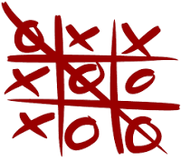
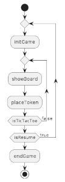
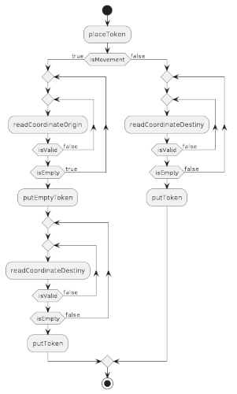
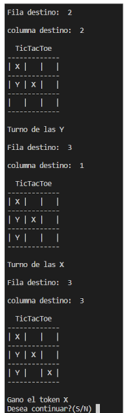

# TicTacToe V0.0

#### Development of the popular game, composed of a 3x3 board and 3 tokens per player. 
[WIKI](https://en.wikipedia.org/wiki/Tic-tac-toe)

Index

- [Technologies](#technologies)
- [Diagrams](#diagrams)
    - [Main sequence](#main-sequence)
    - [Place token function](#place-token-function)
- [Console View](#console-view)

## Technologies

- Javascript on functions
- Views in console

## Diagrams

#### Main sequence

|  |
| -------------------------------------------- |

#### Place token function

|  |
| ---------------------------------------------- |

 

## Console View

